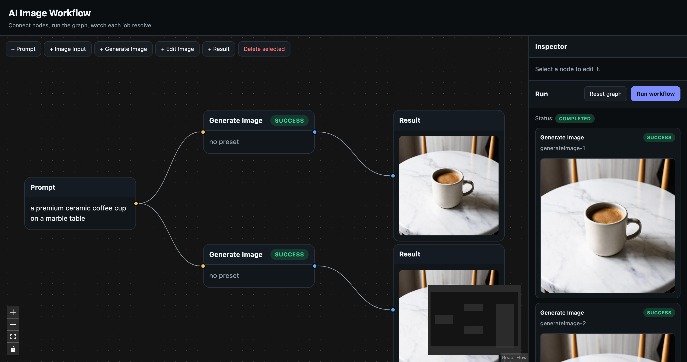

# AI Image Workflow Mini

Node-based редактор AI-генерации изображений. Граф собирается на канвасе,
бэкенд исполняет его как DAG — независимые ветки параллельно, по одной job на
каждый вызов нейросети — и стримит прогресс обратно через SSE.

[](https://github.com/UeberTimei/snapbuild-test-task/actions/workflows/ci.yml)




## Запуск

```bash
bun install
cp apps/api/.env.example apps/api/.env   # вписать HF_TOKEN
bun dev                                  # api :3001, web :5173
```

Открыть `http://localhost:5173` — канвас сразу загружен со сценарием ветвления,
кнопка **Run workflow** запускает граф.

```bash
bun test          # тесты всех пакетов
bun run lint      # oxlint
bun run format    # oxfmt
```

Версии зафиксированы: `.nvmrc` (Node 24.15.0), `engines` и `packageManager`
(Bun 1.3.9).

## Стек

| Слой     | Выбор                                                       | Почему                                                                |
| -------- | ----------------------------------------------------------- | --------------------------------------------------------------------- |
| Монорепа | Bun workspaces + Turborepo                                  | один install, один граф задач, общие типы между фронтом и бэком       |
| Frontend | React 19 + Vite, Feature-Sliced Design, React Flow, zustand | FSD по требованию; канвас на готовой библиотеке, а не свой движок     |
| Backend  | NestJS на рантайме Bun                                      | модули ложатся на домен; Bun запускает Nest без отката на Node        |
| БД       | `bun:sqlite` + Drizzle                                      | персистентность без установки: workflows, presets, runs, jobs, assets |
| Прогресс | SSE                                                         | односторонние апдейты статусов: проще WebSocket, живее polling        |
| Тулинг   | oxlint + oxfmt                                              | по требованию; oxlint заодно стережёт правила импортов FSD            |

## Архитектура

```
Browser ──POST /runs──▶ Nest ──▶ Executor ──▶ Hugging Face
   ▲                              │
   └────GET /runs/:id/events──────┘   (SSE: переходы run и job)

packages/contracts   типы нод, типизированные порты, схема графа, DTO прогонов
apps/api             модули Nest: runs, workflows, presets, assets, ai
apps/web             FSD: app → pages → widgets → features → entities → shared
```

API-ключ живёт только на бэкенде — наружу запросы уходят из Nest.

`packages/contracts` — ключевой пакет: реестр нод, типы портов и валидатор графа
лежат там, поэтому правило соединения на канвасе и валидация графа на бэкенде —
буквально один и тот же код, разойтись они не могут.

**Исполнение.** `POST /runs` валидирует граф (схема, совместимость портов,
обязательные входы, циклы), сохраняет прогон и по job на каждую исполняемую ноду,
сразу возвращает `{ runId }`. Дальше executor резолвит `prompt` и `imageInput` на
месте, стартует все job с готовыми зависимостями в пределах лимита конкурентности
(поэтому `Prompt → (Generate A ∥ Generate B)` идёт в две ветки одновременно),
ведёт каждую по `idle → queued → running → success | error` и отдаёт каждый
переход в SSE — канвас рисует их бейджами на нодах.

**Retry.** `POST /runs/:id/jobs/:jobId/retry` сбрасывает упавшую job и всё, что
ниже неё по графу, и заново входит в тот же цикл планировщика — успешные ветки
не перезапускаются.

**Пресеты.** Пресет — строка в БД (`mainPrompt`, `negativePrompt`, `references`),
а не логика внутри компонента. Чистая функция `buildImageRequest(prompt, preset)`
собирает финальный запрос перед вызовом провайдера.

**FSD.** Слои импортируются строго вниз, каждый слайс доступен только через
`index.ts` — оба правила проверяет oxlint, а не договорённость. Мутации графа в
`entities/workflow`, оркестрация прогона в `features/run-workflow`, правило
соединения в `features/connect-nodes`; `shared/ui` — презентационные компоненты.

| Метод        | Путь                          |                                     |
| ------------ | ----------------------------- | ----------------------------------- |
| POST         | `/runs`                       | запустить прогон графа              |
| GET          | `/runs/:id`                   | снапшот прогона                     |
| GET          | `/runs/:id/events`            | SSE-поток переходов run и job       |
| POST         | `/runs/:id/jobs/:jobId/retry` | ретрай упавшей job и всего ниже неё |
| GET/POST/PUT | `/workflows`                  | сохранение графов                   |
| GET          | `/presets`                    | список пресетов                     |
| POST/GET     | `/assets`                     | загрузка / отдача изображений       |

## Сценарии

1. **`Prompt → Generate Image → Result`** — работает, проверено на живом API.
2. **`Image Input → Edit Image → Result`** — реализован целиком, упирается в
   провайдера (ниже).
3. **`Prompt → (Generate A → Result A) ∥ (Generate B → Result B)`** — ветвление,
   проверено на живом API: обе ветки идут параллельно. Канвас загружает этот
   сценарий при первом открытии.

**Про Edit Image.** Нода собрана сквозняком — upload → asset → `RequestBuilder` →
провайдер → результат — и граф, порты, jobs и retry работают с ней ровно как с
Generate Image. Не хватает провайдера: у `hf-inference` сейчас нет ни одной
image-to-image модели (`400 Model not supported`), а FLUX-модели там отдают
`410 Gone` — их обслуживают платные `fal-ai` и `replicate`. Text-to-image живой
через `stabilityai/stable-diffusion-3-medium-diffusers`, он и стоит по умолчанию.

Поэтому нода доходит до провайдера и падает там — видно как job в статусе `error`
с текстом ошибки и рабочим Retry, то есть заодно как живая демонстрация обработки
ошибок. Чинится без правок executor'а: перенастроить `HF_I2I_MODEL` и
`HF_BASE_URL` на провайдера с image-to-image либо написать второй
`ImageProvider` и подставить его в токен `IMAGE_PROVIDER` — интерфейс из двух
методов, за пределами `apps/api/src/ai/` никто не знает, какой вендор под ним.

## Тесты

31 тест на местах, где ошибка дорого стоит:

- **Параллельность** — две ветки против провайдера, спящего 200 мс, укладываются
  в 350 мс; с `concurrency: 1` тот же граф занимает больше 300 мс. Эта разница и
  есть доказательство параллельного исполнения.
- **Порядок зависимостей** — нижняя job не стартует раньше успеха верхней.
- **Retry** — упавший прогон доходит до `completed`, счётчик попыток растёт.
- **Валидация графа** — циклы, несовместимые по типам рёбра, недостающие
  обязательные входы и неизвестные типы нод отклоняются.
- **e2e** — настоящее Nest-приложение со стаб-провайдером: `POST /runs` → SSE →
  `completed`, картинка отдаётся из `/assets/:id`.
- **Типизированные порты** — соединение `text → image` на канвасе не создаётся.
